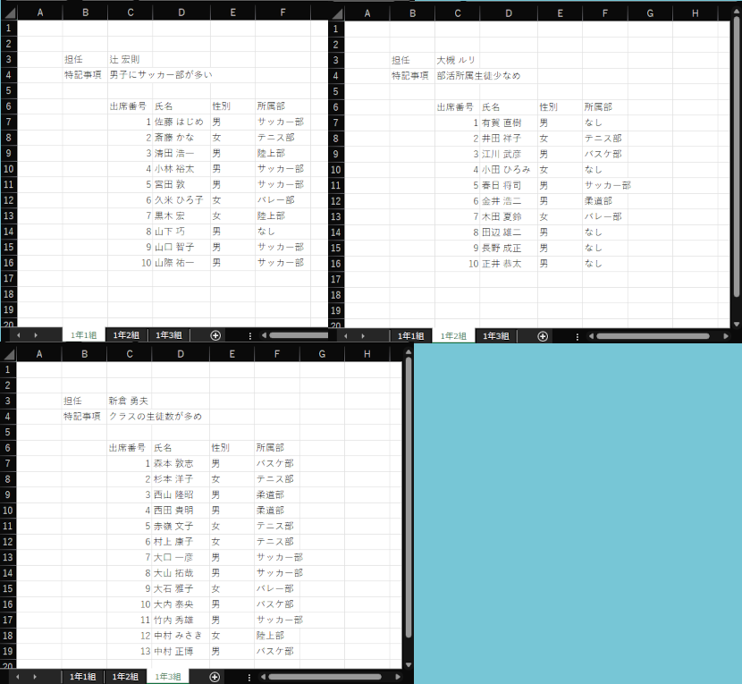

[トップへ](../README.md)
# Excelファイル変換
toj2のExcelファイル変換機能についての解説です。
[先にCSVファイルの変換を理解しておくと解りやすくなります。](../csv/tutorial.md)

## 解っている人はこちら

[既に機能を理解している人はこちら](#Excel変換のコマンド引数)でコマンド引数を参照できます。

## 変換デモ
まず実際に変換するデモをやります。
デモで使用するデータとテンプレートはdocs/excel/samplesディレクトリに置いてあります。

#### デモのシナリオとデータ
デモに使うデータは画像で示す、3つのシートを持つExcelファイルです。
基本的に[CSVファイルのデモと同じ内容](../csv/tutorial.md)ですが、このファイルでは3クラスをまとめて扱っています。クラス名はシート名に書かれています。
また、`出席番号,氏名,部活`の表の他にクラスの担任の名前と簡単なメモが添えられています。
このファイルに含まれる**各クラスの生徒達を所属する部活ごとに分類**して、結果をHTML化します。


#### jinja2テンプレート
このExcelファイルをHTMLに変換するためのjinja2テンプレートを作成します。
CSVファイルの場合とほとんど同じですが、3シート分ループしています。
シート名は各シートの`name`から取得し、さらにシート中の固定の位置にある担任の名前`teacher`と`memo`を個別に取得しています。

また、**シートのC列からカラムカラムを読み取っている**ため、E列にある部活名は`col_02`で表現されます。実行時にコマンド引数で指定した最も左側に来るセルが`col_00`になります。[^unused-zero]

```jinja2:exceldemo.tmpl
<html>
<head> 
    <title>クラス別部活分類</title>
</head>
<body>
<h1>クラス別部活分類</h1>

<h2>{{sheet.name}}</h2>
    <div>担任 {{sheet.abs.teacher}}</div>
    <div>{{sheet.abs.memo}}</div>
<ul>

    <li>{{club_name}}
        <ul>
            
            <li>{{student.col_01}}</li>
            
        </ul>
    </li>
    
</ul>

</ul>
</body>
</html>
```

#### 実行
toj2コマンドを実行します。3枚すべてのシートを対象とするため、シートは`1:3`と指定します。
toj2は範囲指定したセルのみを読込みます。Excelと同じく`C7:F16`のように範囲を指定します。しかし、今回は3枚目のシートだけデータが多いので、`C7:F16`では17行から19行の3行が範囲外になってしまいます。このように**読み取りたい行数が不定の場合は`C7:F`のようにセル範囲の終点側の行数を省略するとデータの存在する全ての行を返します。**[^read-all-cells]
指定範囲外のセルを取得する場合、`--absolute`オプションでセル座標とjinja2内で参照するための名前を指定します。

```sh
toj2 excel exceldemo.tmpl class-students.xlsx 1:3 C7:F  -o result.html --absolute teacher=C3 memo=C4
```
#### 実行結果
結果のHTMLが生成されます。

<details>
<summary>変換されたHTML</summary>
```html
<html>
<head> 
    <title>クラス別部活分類</title>
</head>
<body>
<h1>クラス別部活分類</h1>
<h2>1年1組</h2>
    <div>担任 辻 宏則</div>
    <div>男子にサッカー部が多い</div>
<ul>
    <li>なし
        <ul>
            <li>山下 巧</li>
        </ul>
    </li>
    <li>サッカー部
        <ul>
            <li>佐藤 はじめ</li>
            <li>小林 裕太</li>
            <li>宮田 敦</li>
            <li>山口 博之</li>
            <li>山際 祐一</li>
        </ul>
    </li>
    <li>テニス部
        <ul>
            <li>斎藤 かな</li>
        </ul>
    </li>
    <li>バレー部
        <ul>
            <li>久米 ひろ子</li>
        </ul>
    </li>
    <li>陸上部
        <ul>
            <li>清田 浩一</li>
            <li>黒木 宏</li>
        </ul>
    </li>
</ul>
<h2>1年2組</h2>
    <div>担任 大槻 ルリ</div>
    <div>部活所属生徒少なめ</div>
<ul>
    <li>なし
        <ul>
            <li>有賀 直樹</li>
            <li>小田 ひろみ</li>
            <li>田辺 雄二</li>
            <li>長野 成正</li>
            <li>正井 恭太</li>
        </ul>
    </li>
    <li>サッカー部
        <ul>
            <li>春日 将司</li>
        </ul>
    </li>
    <li>テニス部
        <ul>
            <li>井田 祥子</li>
        </ul>
    </li>
    <li>バスケ部
        <ul>
            <li>江川 武彦</li>
        </ul>
    </li>
    <li>バレー部
        <ul>
            <li>木田 夏鈴</li>
        </ul>
    </li>
    <li>柔道部
        <ul>
            <li>金井 浩二</li>
        </ul>
    </li>
</ul>
<h2>1年3組</h2>
    <div>担任 新倉 勇夫</div>
    <div>クラスの生徒数が多め</div>
<ul>
    <li>サッカー部
        <ul>
            <li>大口 一彦</li>
            <li>大山 拓哉</li>
            <li>竹内 秀雄</li>
        </ul>
    </li>
    <li>テニス部
        <ul>
            <li>杉本 洋子</li>
            <li>赤嶺 文子</li>
            <li>村上 康子</li>
        </ul>
    </li>
    <li>バスケ部
        <ul>
            <li>森本 敦志</li>
            <li>大内 泰央</li>
            <li>中村 正博</li>
        </ul>
    </li>
    <li>バレー部
        <ul>
            <li>大石 雅子</li>
        </ul>
    </li>
    <li>柔道部
        <ul>
            <li>西山 隆昭</li>
            <li>西田 貴明</li>
        </ul>
    </li>
    <li>陸上部
        <ul>
            <li>中村 みさき</li>
        </ul>
    </li>
</ul>
</ul>
</body>
</html>
```

</details>

### 動作の仕組み
Excel読込みの結果は以下の構造で返されます。

```python
{
  # 各シートごとのリスト 左側のシートから順に並べられる
  'sheets' : [
    { # シート1件分のデータ
      'name': '1年1組',           # シート名
      'abs': { 'teacher' : 'C3', 'memo' : 'C4' },     # 指定座標セル
      'rows': [
            { # 各行ごとのdict
                'col_00' : '1',
                'col_01' : '佐藤 はじめ',
                'col_02' : '男',
                'col_03' : 'サッカー部'
            }
        ],
    }, 
  ]
  # 起動時に渡したパラメータ（このデモでは空）
  'params' : {}
}
```

CSVとは構造が違うだけで、これがjinja2にそのまま渡されることは一緒です。
**CSVと違って、Excelではカラム名を表す項目`cols`がありませんが、これは今後のバージョンで追加予定です**

## Excel変換のコマンド引数
Excel変換ではExcel変換固有の位置引数を持ち、省略不可能になっています。
toj2全体のコマンド引数については[共通の引数](../README.md#共通コマンド引数)を参照してください。


### 位置引数
以下の`book.xlsx`移行は全て必須の位置引数です。

```sh
toj2 excel excel.tmpl book.xlsx 1:3 A1:D4
```

#### 読込みファイル
`book.xlsx`の部分です。

Excel変換では`sys.stdin`からの読込みに対応しないため、読込みファイルの指定は必須です。

#### **シート範囲**
`1:3`の部分です。
ファイルから読込むシートを指定します。以下のパターンの形式で指定できます。

```
# 1枚目のシートを読込む 引数 1
toj2 excel excel.tmpl book.xlsx 1 A1:D4
# 2枚目のシートを読込む 引数 2
toj2 excel excel.tmpl book.xlsx 2 A1:D4
# 1枚目から3枚目までのシートを読込む 引数 1:3
toj2 excel excel.tmpl book.xlsx 1:3 A1:D4
# 1枚目以降の全てのシートを読込む 引数 1:
toj2 excel excel.tmpl book.xlsx 1: A1:D4
```

#### カラム範囲
 `A1:D4`の部分です。
 ファイルから読み込むセルの範囲を指定します。
以下のようなパターンが指定できます。

```
# A1からD4の範囲を読込む 引数 A1:D4
toj2 excel excel.tmpl book.xlsx 1 A1:D4
# A1を起点として、存在する全ての行をD列まで読込む 引数 A1:D
toj2 excel excel.tmpl book.xlsx 1 A1:D
```

toj2はシート内のセル範囲ひとつのみを取得できます。`A1:D4`と`H2:J16`を同時に取得するような操作はできません。

### コマンドオプション
以下は実際にExcel変換を行う際に使用するコマンドラインオプションです。
toj2全体のコマンド引数については[共通の引数](../README.md#共通コマンド引数)を参照してください。

#### --names カラムに名前を付ける
カラム名を指定します。デフォルトではカラム名は、`['col_00', 'col_01', 'col_02']`のような連番になりますが、`--names`オプションを指定した以下の呼出しでは`['name', 'age', 'job']`のように命名されます。

**テンプレートの保守性のために、常に--namesオプションを指定することを強く推奨します。**

```sh
# 左から順に名前を付ける
toj2 excel excel.tmpl book.xlsx 1 A1:D4  --names name age job
```
同じ名前が二回以上指定された場合、読み込まれる値は最後に読み込まれたものが使用されます。

#### --absolute 特定のセルの値を取得する
位置引数で指定する取得範囲の外側にあるセルの値を取得します。`名前=セル位置`の形式で指定します。
取得した内容は各`sheet.abs`に格納されます。このファイル冒頭のデモで実際に使用しています。`--absolute`オプションは複数並べて指定することができます。
```sh
# セルA1をvalue1という名前で、A2をvalue2という名前で取得する
toj2 excel excel.tmpl book.xlsx 1 A3:D6 --absolute value1=A1 value2=A2
```

[トップへ](../README.md)

[^unused-zero]: ただし、今回`col_00`は使用していません。これはCSVチュートリアルとある程度の整合性を取るようにしているためなので。コマンドで`D3:F`としてすれば`col_00`が氏名として取得されます。
[^read-all-cells]: `C3:F`のような「全てのデータを取得する」という仕組みは実は**openpyxlに丸投げ**しているので、どんな行が返されるかあまり把握できていません。末尾に余分な行が付いてくる場合、Excel側で行を削除するとうまく行く場合があります。
